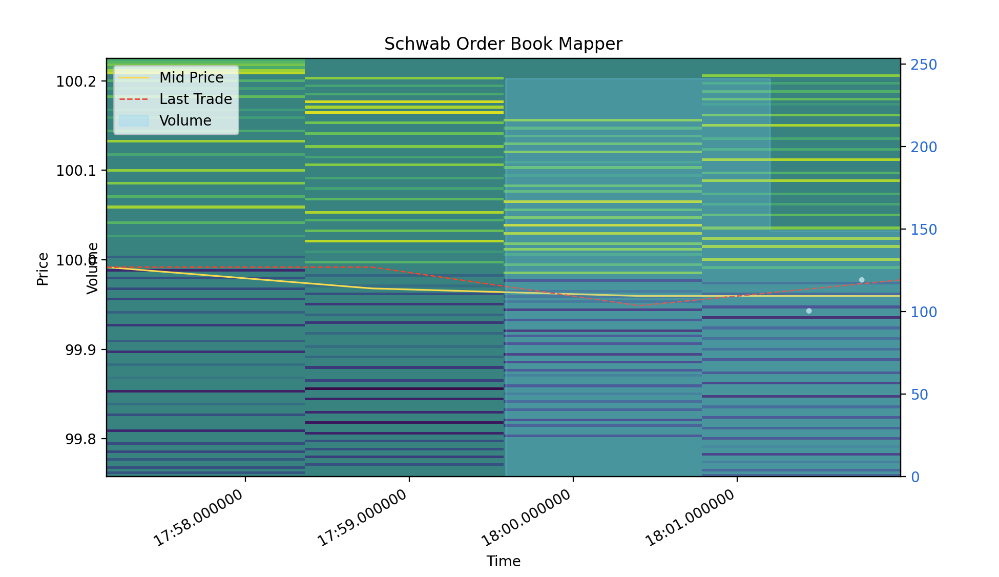
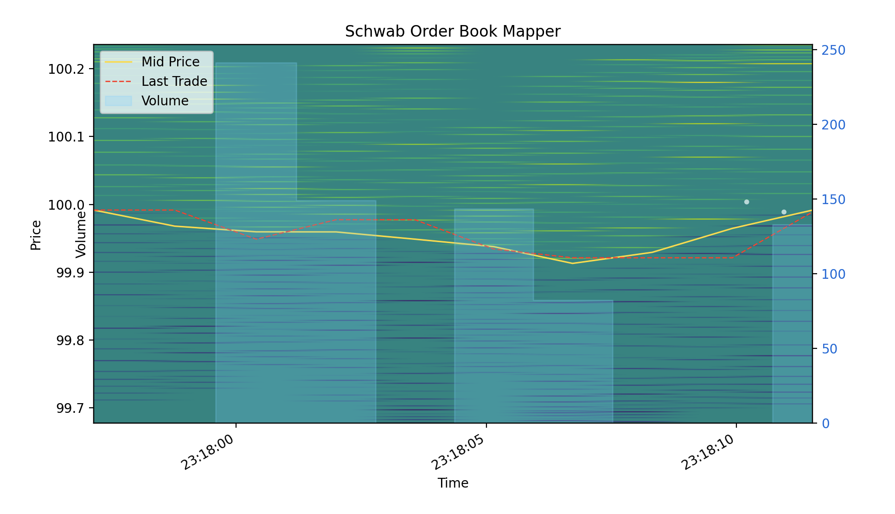
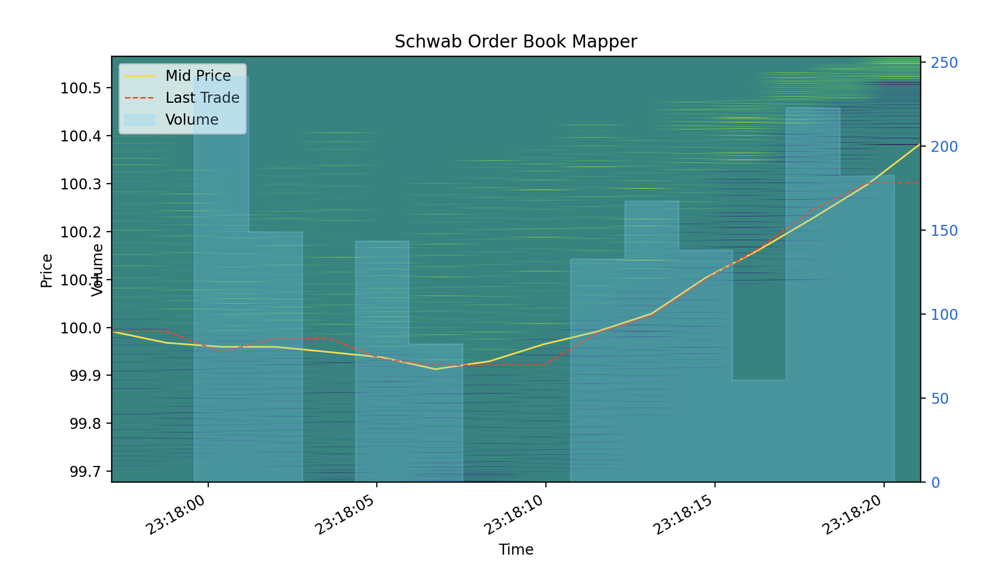

# schwab-orderbook-mapper

To aid my intraday options trading strategy by displaying Level-2, Time&Sales, and Volume data live for *x* underlying asset using the Schwab API

- To execute:
  - Store APP_KEY and APP_SECRET in .venv 
  - Authenticate 

- To test:
``python schwab.py FAKE --mock --depth 20 --interval 1.5 --mock-duration 120``

- To run during market hours:
``python schwab.py --authorize TICKER``